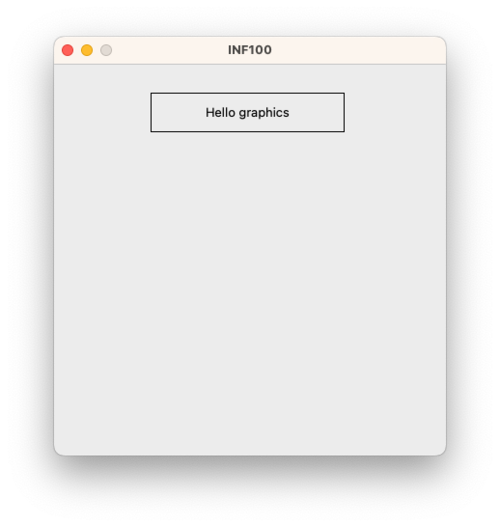

# UiB INF100 Graphics

- [About](#about)
- [Installation](#installation)

For sample usage, see the docs on the [simple](./docs/simple.md) and [event_app](./docs/event_app.md) subpackages, as well as the provided [examples](./examples/).

## About

UiB INF100 Graphics is a framework creating graphics and interactive applications for new beginners in programming. It consists of two subpackages: 
 - `basic`, which is intended for the first few weeks of an introductory course. This package let us create images and animations in a desktop frame with a simple, iterative programming paradigm.
 - `event_app`, which is intended for creating a first interactive, graphical desktop application.

Note that the `simple` subpackage and the `event_app` subpackage are *not* designed be used simultaneously.

> For teachers: this framework is a wrapper around a [Canvas](https://tkinter-docs.readthedocs.io/en/latest/widgets/canvas.html) object from Python's [tkinter](https://docs.python.org/3/library/tkinter.html), designed to simplify the framework with these principles in mind:
> - creative learning: allow users to be creative with programming as early as possible.
> - authenticity: functions are named and behave (as far as possible) the same as for a true tkinter canvas. This gives an authentic experience and seamless transition to the more advanced framework later.
> - classes come later: knowing the object-oriented programming paradigm is not neccessary in order to use the framework.
> - the `basic` package is made for a purely iterative experience; similar to the turtle package.
> - the `event_app` package is for creating interactive applications using an event-based paradigm. It designed to enforce the use of model-view-controller.


## Installation

**Prerequisites**

Python 3.10 or above, in an installation *that includes Tkinter*. Note that the standard installer downloaded from [python.org](https://www.python.org) includes this by default, whereas some installers that are provided by package managers such as homebrew and apt-get does not, and Tkinter then needs to be installed separately.

For Linux users only, the package [pyscreenshot](https://github.com/ponty/pyscreenshot) must be installed for all features to work.

**Installation with pip through the Terminal**

1. Ensure your Python version is version 3.10 or higher. The command
```
python --version
```
should print "Python 3.10.4" or something similar. As long as it is 3.10 or higher, you're ok. If it does not immediately work, you may also try to replace "python" with `python3` or simply `py` (if so, you must make the same replacement for the commands below).

2. Ensure you are using an updated version of pip. Run
```
python -m pip install --upgrade pip
```

3. Install uib-inf100-graphics
```
python -m pip install uib-inf100-graphics
```

**Alternative installation by running a Python script**

Copy and paste the following code into a python file, and then run it.

```python
import sys
from subprocess import run

package_name = "uib-inf100-graphics"

if ((sys.version_info[0] != 3) or (sys.version_info[1] < 10)):
    raise Exception(f"{package_name} requires Python 3.10 or later. "
            + "Your current version is: "
            + f"{sys.version_info[0]}.{sys.version_info[1]}")

ans = input(f"\n\nType 'yes' to install {package_name}: ")
if ((ans.lower() == "yes") or (ans.lower() == "y")):
    print()
    cmd_pip_update = f"{sys.executable} -m pip install --upgrade pip"
    print(f"Attempting to update pip with command: {cmd_pip_update}")
    run(cmd_pip_update.split())
    
    print()
    cmd_install = f"{sys.executable} -m pip install {package_name}"
    print(f"Attempting to install {package_name} with command: {cmd_install}")
    run(cmd_install.split())
else:
    print(f"Did not attempt to install {package_name} now")
print("\n")
```


## Sample usage: the simple subpackage

The uib-inf00-graphics package has two different modes in which it can be used, where the *simple* mode is intended for novices with no prior programming experience. To use simple mode, we must import *canvas* and *display* from *uib_inf100_graphics.simple* like in the first line of the code snippet below. You may then draw different shapes on the canvas using various functions, for example *create_rectangle* and *create_text*; when you are done, you can display on the screen what you have drawn on the canvas using the display function.

```python
from uib_inf100_graphics.simple import canvas, display

canvas.create_rectangle(100, 30, 300, 70)
canvas.create_text(200, 50, text="Hello graphics")

display(canvas)
```




## Sample usage: the event_app subpackage

> You must not mix the `event_app` subpackage with the `simple` subpackage in the same program.

The event_app subpackage is for programmers who are ready to create their first interactive desktop application. A very basic knowledge of Python fuctions is required to use the package.

To make a static drawing akin to the example for the simple subpackage above, the event_app subpackage requires us to import *run_app* from *uib_inf100_graphics.event_app*, and define a function called *redraw_all* which accepts two parameters by convention named *app* and *canvas*.

```python
from uib_inf100_graphics.event_app import run_app

def redraw_all(app, canvas):
    canvas.create_rectangle(100, 30, 300, 70)
    canvas.create_text(200, 50, text="Hello graphics")

run_app(width=400, height=400)
```

It is possible to draw on the canvas using exactly the same functions as we know from the simple subpackage, except now the code must reside in the redraw_all function.

When using the *event_app* subpackage, there are several reserved function names that have a special meaning in the framework. The most important ones are:

- **redraw_all(app, canvas)** is a function which is called every time an app variable changes. This function has two parameters: 
    - `app`: think of this as a collection of all the variables that matters for our application. In the redraw_all function you may look at these variables, but not change any of them.
    - `canvas`: the canvas on which we can draw things. All the drawing functions we know from the simple subpackage also works on this canvas.
- **app_started(app)** is a function which is called once when the application starts. In this function, we should give initial values to any app variables we intend to use.
- **timer_fired(app)** is a function which is called periodically (roughly 10 times each second by default). In this function we may modify the app variables.
- **key_pressed(app, event)** is a function which is called every time the user presses a key. Exactly which key was pressed is stored in the `event.key` variable. In this function we may modify the app variables.
- **mouse_pressed(app, event)** is a function which is called every time the user presses the mouse in the window. Exactly where the mouse was pressed is stored in the `event.x` and `event.y` variables. In this function we may modify the app variables.

Other reserved function names in the framework (which are less commonly used) are: *app_stopped(app)*, *key_released(app, event)*, *mouse_released(app, event)*, *mouse_moved(app, event)*, *mouse_dragged(app, event)* and *size_changed(app)*

A few examples illustrating different usages:

### Animate with a timer

```python
from uib_inf100_graphics.event_app import run_app

def app_started(app):
    # Define app variables to use
    app.x_offset = 0

def timer_fired(app):
    # Update app variable periodically with a timer
    app.x_offset += 10
    if (app.x_offset > 300):
        app.x_offset = 0

def redraw_all(app, canvas):
    # Draw a ball and position it depending on state of app variables
    x1 = 10 + app.x_offset
    y1 = 50
    x2 = x1 + 20
    y2 = y1 + 20
    canvas.create_oval(x1, y1, x2, y2, fill="yellow")

run_app(width=400, height=100)
```

### React to keyboard input


```python
from uib_inf100_graphics.event_app import run_app

def app_started(app):
    # Define app variables to use
    app.x_offset = 0
    app.y_offset = 0
    app.radius = 20

def key_pressed(app, event):
    # Update variables when a key is pressed
    if   (event.key == "Left"):  app.x_offset -= 10
    elif (event.key == "Right"): app.x_offset += 10
    elif (event.key == "Up"):    app.y_offset -= 10
    elif (event.key == "Down"):  app.y_offset += 10
    elif (event.key == "Space"): app.radius += 1
    elif (event.key == "m"):     app.radius -= 1

def redraw_all(app, canvas):
    # Draw a ball and position it depending on state of app variables
    cx = (app.width / 2) + app.x_offset
    cy = app.height / 2 + app.y_offset
    x1 = cx - app.radius
    y1 = cy - app.radius
    x2 = cx + app.radius
    y2 = cy + app.radius
    canvas.create_oval(x1, y1, x2, y2, fill="yellow")

run_app(width=400, height=100)
```


### React to mouse input

```python
from uib_inf100_graphics.event_app import run_app

def app_started(app):
    # Define app variables to use, and set initial values
    app.cx = app.width / 2
    app.cy = app.height / 2
    app.radius = 20

def mouse_pressed(app, event):
    # Update variables when mouse is pressed
    app.cx = event.x
    app.cy = event.y

def redraw_all(app, canvas):
    # Draw a ball and position it depending on state of app variables
    x1 = app.cx - app.radius
    y1 = app.cy - app.radius
    x2 = app.cx + app.radius
    y2 = app.cy + app.radius
    canvas.create_oval(x1, y1, x2, y2, fill="yellow")

run_app(width=400, height=100)
```


### Use with type hints

```python
from uib_inf100_graphics.event_app import run_app
from uib_inf100_graphics.event_app.types import (
    AppBase, MouseEvent, KeyEvent, Canvas
)

class App(AppBase):
    # Define types of variables to use
    cx: float
    cy: float
    radius: float

def app_started(app: App) -> None:
    # Set initial values of all variables
    app.cx = app.width / 2
    app.cy = app.height / 2
    app.radius = 20

def timer_fired(app: App) -> None:
    # Update variables every time timer fires
    app.cx += 1
    app.cy += 1

def key_pressed(app: App, event: KeyEvent) -> None:
    # Update variables if keys are pressed
    if event.key == "Up":
        app.radius += 1
    elif event.key == "Down":
        app.radius -= 1

def mouse_pressed(app: App, event: MouseEvent) -> None:
    # Update variables when mouse is pressed
    app.cx = event.x
    app.cy = event.y

def redraw_all(app: App, canvas: Canvas) -> None:
    # Draw a ball, and position it depending on state of variables
    x1 = app.cx - app.radius
    y1 = app.cy - app.radius
    x2 = app.cx + app.radius
    y2 = app.cy + app.radius
    canvas.create_oval(x1, y1, x2, y2, fill="yellow")

run_app(width=400, height=100)
```