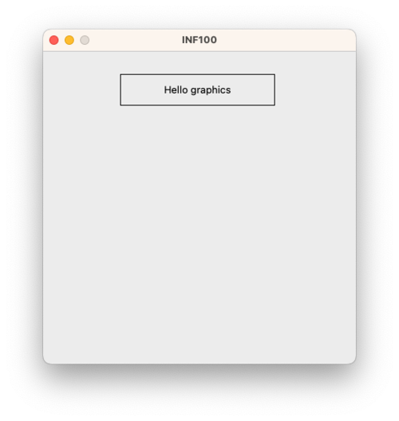

# The `event_app` subpackage

The `event_app` subpackage is designed for creating simple interactive (reacting to the use of mouse and/or keyboard) desktop applications. If you are only interested in creating a drawing or an animation, the [simple](simple.md) subpackage is more suitable.

An elementary knowledge of Python fuctions and variables is required to use the package.

> You should not mix the `event_app` subpackage with the `simple` subpackage in the same program.

To display something in an event_app window, we must import *run_app* from `uib_inf100_graphics.event_app`, and define a function called *redraw_all* which accepts two parameters by convention named *app* and *canvas*. Finally, we must make a call to the run_app function:

```python
from uib_inf100_graphics.event_app import run_app

def redraw_all(app, canvas):
    canvas.create_rectangle(100, 30, 300, 70)
    canvas.create_text(200, 50, text="Hello graphics")

run_app(width=400, height=400)
```



It is possible to draw on the canvas using exactly the same functions as we know from the simple subpackage, except now the code must reside in the redraw_all function.

When using the `event_app` subpackage, there are several reserved function names that have a special meaning in the framework. The most important ones are:

- **redraw_all(app, canvas)** is a function which is called every time an app variable changes. This function has two parameters: 
    - `app`: think of this as a collection of all the variables that matters for our application. In the redraw_all function you may look at these variables, but not change any of them.
    - `canvas`: the canvas on which we can draw things. All the drawing functions we know from the simple subpackage also works on this canvas.
- **app_started(app)** is a function which is called once when the application starts. In this function, we should give initial values to any app variables we intend to use.
- **timer_fired(app)** is a function which is called periodically (roughly 10 times each second by default). In this function we may modify the app variables.
- **key_pressed(app, event)** is a function which is called every time the user presses a key. Exactly which key was pressed is stored in the `event.key` variable. In this function we may modify the app variables.
- **mouse_pressed(app, event)** is a function which is called every time the user presses the mouse in the window. Exactly where the mouse was pressed is stored in the `event.x` and `event.y` variables. In this function we may modify the app variables.

Other reserved function names in the framework are: *app_stopped(app)*, *key_released(app, event)*, *mouse_released(app, event)*, *mouse_moved(app, event)*, *mouse_dragged(app, event)* and *size_changed(app)*

A few examples illustrating different usages:

### Animate with a timer

```python
from uib_inf100_graphics.event_app import run_app

def app_started(app):
    # Define app variables to use
    app.x_offset = 0

def timer_fired(app):
    # Update app variable periodically with a timer
    app.x_offset += 10
    if (app.x_offset > 300):
        app.x_offset = 0

def redraw_all(app, canvas):
    # Draw a ball and position it depending on state of app variables
    x1 = 10 + app.x_offset
    y1 = 50
    x2 = x1 + 20
    y2 = y1 + 20
    canvas.create_oval(x1, y1, x2, y2, fill="yellow")

run_app(width=400, height=100)
```

### React to keyboard input


```python
from uib_inf100_graphics.event_app import run_app

def app_started(app):
    # Define app variables to use
    app.x_offset = 0
    app.y_offset = 0
    app.radius = 20

def key_pressed(app, event):
    # Update variables when a key is pressed
    if   (event.key == "Left"):  app.x_offset -= 10
    elif (event.key == "Right"): app.x_offset += 10
    elif (event.key == "Up"):    app.y_offset -= 10
    elif (event.key == "Down"):  app.y_offset += 10
    elif (event.key == "Space"): app.radius += 1
    elif (event.key == "m"):     app.radius -= 1

def redraw_all(app, canvas):
    # Draw a ball and position it depending on state of app variables
    cx = (app.width / 2) + app.x_offset
    cy = app.height / 2 + app.y_offset
    x1 = cx - app.radius
    y1 = cy - app.radius
    x2 = cx + app.radius
    y2 = cy + app.radius
    canvas.create_oval(x1, y1, x2, y2, fill="yellow")

run_app(width=400, height=100)
```


### React to mouse input

```python
from uib_inf100_graphics.event_app import run_app

def app_started(app):
    # Define app variables to use, and set initial values
    app.cx = app.width / 2
    app.cy = app.height / 2
    app.radius = 20

def mouse_pressed(app, event):
    # Update variables when mouse is pressed
    app.cx = event.x
    app.cy = event.y

def redraw_all(app, canvas):
    # Draw a ball and position it depending on state of app variables
    x1 = app.cx - app.radius
    y1 = app.cy - app.radius
    x2 = app.cx + app.radius
    y2 = app.cy + app.radius
    canvas.create_oval(x1, y1, x2, y2, fill="yellow")

run_app(width=400, height=100)
```


### Use with type hints

```python
from uib_inf100_graphics.event_app import run_app
from uib_inf100_graphics.event_app.types import (
    AppBase, MouseEvent, KeyEvent, Canvas
)

class App(AppBase):
    # Define types of variables to use
    cx: float
    cy: float
    radius: float

def app_started(app: App) -> None:
    # Set initial values of all variables
    app.cx = app.width / 2
    app.cy = app.height / 2
    app.radius = 20

def timer_fired(app: App) -> None:
    # Update variables every time timer fires
    app.cx += 1
    app.cy += 1

def key_pressed(app: App, event: KeyEvent) -> None:
    # Update variables if keys are pressed
    if event.key == "Up":
        app.radius += 1
    elif event.key == "Down":
        app.radius -= 1

def mouse_pressed(app: App, event: MouseEvent) -> None:
    # Update variables when mouse is pressed
    app.cx = event.x
    app.cy = event.y

def redraw_all(app: App, canvas: Canvas) -> None:
    # Draw a ball, and position it depending on state of variables
    x1 = app.cx - app.radius
    y1 = app.cy - app.radius
    x2 = app.cx + app.radius
    y2 = app.cy + app.radius
    canvas.create_oval(x1, y1, x2, y2, fill="yellow")

run_app(width=400, height=100)
```