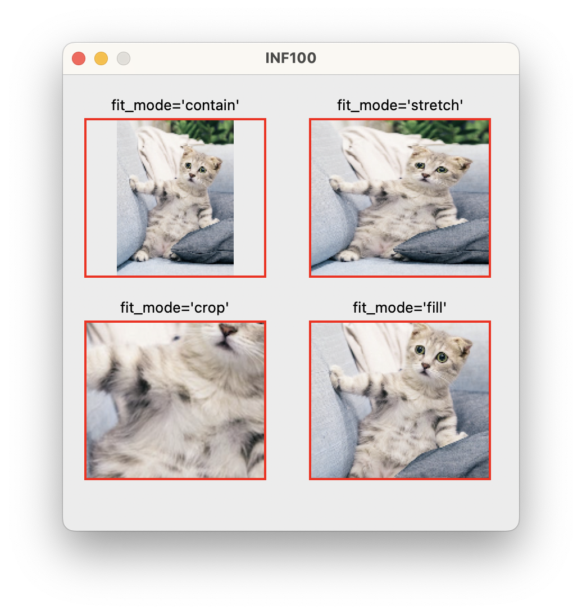
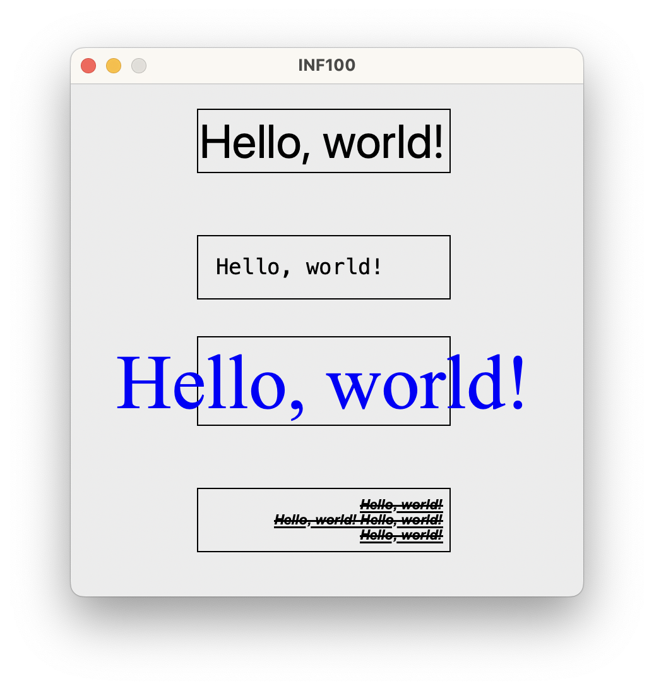

# The `helpers` subpackage

The `helpers` subpackage contains a few helper functions to make it easier to do some common but not-built-in tasks related to graphics programming on a canvas.

Related to images
- [load_image](#load_image)
    opens an image from file
- [load_image_http](#load_image_http)
    downloads an image
- [scaled_image](#scaled_image)
    changes size of an image
- [image_in_box](#image_in_box)
    draws an image within a rectangle

Related to text
- [text_in_box](#text_in_box)
    draws text within a rectangle

#### load_image

Load an image from a file or URL. If no path is given, a file dialog is shown to select a file. If the path starts with 'http', the image is loaded from the internet. Otherwise, the image is loaded from a file on disk. If the user cancels the file dialog, None is returned. Otherwise, the loaded image is returned (a PIL image). If the image cannot be loaded, an error is raised.


#### load_image_http

Load an image from a URL. The loaded image is returned (a PIL image). If the image cannot be loaded, an error is raised.

See docs for [create_image](./simple.md#create_image) for example usage.


#### scaled_image

Scale an image by a given factor.

Parameters
- image: the image to scale.
- scale: the scale factor.
- antialias (optional): Whether to use antialiasing, by default False. Antialiasing produces a higher-quality image but is slower.

Returns the scaled image.

See docs for [create_image](./simple.md#create_image) for example usage.

#### image_in_box

Create an image on a canvas, fitting it into a given rectangle. The image is scaled and/or cropped to fit the rectangle. The rectangle is specified by the coordinates of its top-left and bottom-right corners. The image is centered within the rectangle.

Parameters:
- *canvas*: The canvas on which to create the image.
- *x1*: The x-coordinate of the top-left corner of the rectangle.
- *y1*: The y-coordinate of the top-left corner of the rectangle.
- *x2*: The x-coordinate of the bottom-right corner of the rectangle.
- *y2*: The y-coordinate of the bottom-right corner of the rectangle.
- *pil_image*: The image to draw.
- *fit_mode* (optional): The fit mode, by default 'contain'. The fit mode determines how the image is scaled to fit the rectangle. The following fit modes are available:
    - 'contain': The image is scaled to fit inside the rectangle while preserving the aspect ratio. The entire image is visible, but the rectangle may not be completely filled.
    - 'fill': The image is scaled to fill the entire rectangle while preserving the aspect ratio. The entire rectangle is filled, but the image may not be completely visible.
    - 'crop': The image is not scaled, but cropped to fit the rectangle if necessary. There is no guarantee that the entire image is visible or that the entire rectangle is filled.
    - 'stretch': The image is scaled to fill the entire rectangle without preserving the aspect ratio. The entire rectangle is filled and the intire image is visible, but the image may be distorted.
- *antialias* (optional): Whether to use antialiasing, by default False. Antialiasing produces a higher-quality image but is slower.

```python
from uib_inf100_graphics.simple import canvas, display
from uib_inf100_graphics.helpers import load_image_http, image_in_box

# Image credits: unsplash.com/@tranmautritam
image = load_image_http('https://tinyurl.com/inf100kitten-png')

image_in_box(canvas, 20, 40, 180, 180, image)
canvas.create_rectangle(20, 40, 180, 180, outline='red', width=2)
canvas.create_text(100, 35, text="fit_mode='contain'", anchor='s')

image_in_box(canvas, 20, 220, 180, 360, image, fit_mode='crop')
canvas.create_rectangle(20, 220, 180, 360, outline='red', width=2)
canvas.create_text(100, 215, text="fit_mode='crop'", anchor='s')

image_in_box(canvas, 220, 40, 380, 180, image, fit_mode='stretch')
canvas.create_rectangle(220, 40, 380, 180, outline='red', width=2)
canvas.create_text(300, 35, text="fit_mode='stretch'", anchor='s')

image_in_box(canvas, 220, 220, 380, 360, image, fit_mode='fill')
canvas.create_rectangle(220, 220, 380, 360, outline='red', width=2)
canvas.create_text(300, 215, text="fit_mode='fill'", anchor='s')

display(canvas)
```




#### text_in_box

Create text on a canvas, fitting it into a given rectangle. The font size is scaled to fit the rectangle. 

**Positional/required parameters:**
- *canvas*: The canvas on which to draw the text.
- *x1*: The x-coordinate of the top-left corner of the rectangle.
- *y1*: The y-coordinate of the top-left corner of the rectangle.
- *x2*: The x-coordinate of the bottom-right corner of the rectangle.
- *y2*: The y-coordinate of the bottom-right corner of the rectangle.
- *text*: The text to draw.

**Optional parameters:**
- *font*: The font to use. If None, unspecified or not found, the default font will be used. The font can be specified as a font name string or a tuple of the form (font_family, font_size, font_style). A font name string can be a the name of a system-installed font family or a *named font* (see also paragraph about fonts in the [create_text](./simple.md#create_text) section).

Note that the size (if specifed) of the font will be ignored, since the font size will be scaled to fit the rectangle. However, it is still necessary to specify *some* value for the font size when using a font specifier tuple or when providing options such as 'bold' or 'italic'.

- *fit_mode*: The fit mode, by default 'contain'. The fit mode determines how the text is scaled to fit the rectangle. The following fit modes are available:
    - 'contain': The text is scaled to fit entirely inside the rectangle (unless the minimum font size is reached).
    - 'fill': The font size is scaled such that the text area will fill the entire rectangle. The text may overflow either vertically or horizontally (but not both).
    - 'height': The text is scaled to fit the height of the rectangle (the width of the rectangle will be ignored). The text may overflow horizontally.
    - 'width': The text is scaled to fit the width of the rectangle (the height of the rectangle will be ignored). The text may overflow vertically.
- *padding*: The padding, by default 0. The padding is the minimum number of pixels between the text and the edges of the rectangle.
- *min_font_size*: The minimum font size, by default 1. The font size will never be scaled below this value, even if the text does not fit in the rectangle.
- *justify*: The horizontal justification, by default 'center'. The horizontal justification determines how the text is aligned horizontally within the rectangle. The following justifications are available: 'left', 'center', 'right'.
- *align*: The vertical alignment, by default 'center'. The vertical alignment determines how the text is aligned vertically within the rectangle. The following alignments are available: 'top', 'center', 'bottom'.
- *fill*: The text color.


```python
from uib_inf100_graphics.simple import canvas, display
from uib_inf100_graphics.helpers import text_in_box

text = "Hello, world!"

# First example
canvas.create_rectangle(100, 20, 300, 70)
text_in_box(canvas, 100, 20, 300, 70, text)

# Named font and padding.
canvas.create_rectangle(100, 120, 300, 170)
text_in_box(canvas, 100, 120, 300, 170, text,
            font="TkFixedFont",
            justify="left",
            padding=15)

# System installed font family name, fill color and fit_mode.
canvas.create_rectangle(100, 200, 300, 270)
text_in_box(canvas, 100, 200, 300, 270, text,
            font="Times new roman",
            fit_mode='height',
            fill="blue")

# Multiline text, font style, justification.
multiline_text = text+"\n"+text+" "+text+"\n"+text
canvas.create_rectangle(100, 320, 300, 370)
text_in_box(canvas, 100, 320, 300, 370, multiline_text,
            font="Arial 42 bold italic overstrike underline",
            justify="right", # justify is 'left', 'center' or 'right'
            padding=5)

display(canvas)
```



For a full interactive demo of all the options, run [text_in_box_demo_app.py](../examples/helpers/text_in_box_demo_app.py)