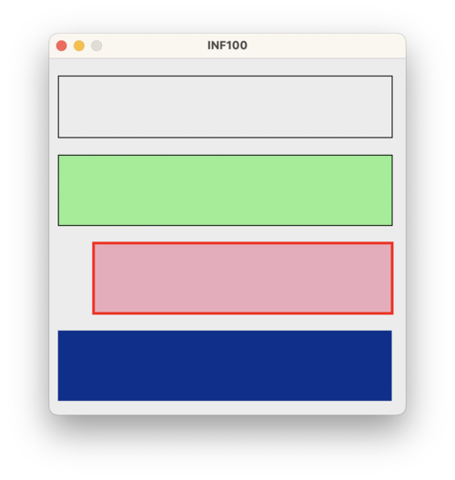

# The `simple` subpackage

The `simple` subpackage of the uib-inf100-graphics library is capable of displaying single images and animations in a desktop window. For creating interactive applications, see the [event_app](./event_app.md) subpackage instead.

- [First example](#first-example)
- [The coordinate system](#the-canvas-coordinate-system)
- [Functions for drawing](#functions-for-drawing)
- [Configuration](#configuration)

## First example

To use, import *canvas* and *display* from `uib_inf100_graphics.simple` like in the first line of the code snippet below. We may then draw different shapes on the canvas using various drawing functions, for example *create_rectangle* and *create_text*; when we are done, we can display on the screen what we have drawn on the canvas using the display function.

```python
from uib_inf100_graphics.simple import canvas, display

canvas.create_rectangle(100, 30, 300, 70)
canvas.create_text(200, 50, text="Hello graphics")

display(canvas)
```


## The canvas coordinate system

The displayed window will by default be 400x400 pixels. Note that unlike mathemathics, the y-axis grows *downwards*. This means that a y-value of 0 is on the top of the window, whereas a y-value of 400 is on the bottom of the window. In the program below, we draw
a polygon, and also draw labels which shows where the coordinates are (the center point of the text label will be on the given coordinate)

```python
from uib_inf100_graphics.simple import canvas, display

# polygon defined by four (x, y) coordinates (the corners)
canvas.create_polygon(200, 50,
                      350, 200,
                      200, 350,
                      50, 200,
                      outline="gray",
                      fill="")

# draw labels on the same points as corners of polygon
canvas.create_text(200, 50, text="(200, 50)")
canvas.create_text(350, 200, text="(350, 200)")
canvas.create_text(200, 350, text="(200, 350)")
canvas.create_text(50, 200, text="(50, 200)")

# x-label with arrow
canvas.create_text(180, 20, text="x", anchor="se")
canvas.create_line(180, 20, 185, 40, arrow="last")

# y-label with arrow
canvas.create_text(220, 20, text="y", anchor="sw")
canvas.create_line(220, 20, 215, 40, arrow="last")

display(canvas)
```


## Functions for drawing

We may use a couple of different functions to draw various shapes, text and images. Se also [examples/simple_stills](../examples/simple_stills/).

- [create_rectangle](#create_rectangle)
- [create_oval](#create_oval)
- [create_line](#create_line)
- [create_polygon](#create_polygon)
- [create_text](#create_text)
- [create_arc](#create_arc)
- [create_image](#create_image)


#### create_rectangle

The first two parameters are the x and y coordinates of one corner of the rectangle, and the next two parameters are the x and y coordinates of the opposite corner. By convention, the first point is the left upper corner, whereas the second point is the right lower corner.

The rectangle is drawn with a black outline and no fill by default, but this can be changed by providing arguments to the optional *outline* and *fill* parameters. The *width* parameter can be used to change the width of the outline.

```python
from uib_inf100_graphics.simple import canvas, display

canvas.create_rectangle(10, 20, 390, 90)
canvas.create_rectangle(10, 110, 390, 190, fill='lightGreen')
canvas.create_rectangle(50, 210, 390, 290, fill='#eeaabb',
                        outline="red", width=3)
canvas.create_rectangle(10, 310, 390, 390, fill='#00308f', width=0)

display(canvas)
```



For a more comprehensive documentation on the create_rectangle -method, see https://tkinter-docs.readthedocs.io/en/latest/widgets/canvas.html#Canvas.create_rectangle

#### create_oval

Ovals are created by specifying the points of the bounding rectangle of the oval; hence the first four parameters represents the two opposite corners of a rectangle.

The optional parameters *fill*, *outline* and *width* also works the same as for a rectangle.

```python
from uib_inf100_graphics.simple import canvas, display

canvas.create_oval(10, 20, 390, 90)
canvas.create_rectangle(10, 20, 390, 90)

canvas.create_oval(10, 110, 390, 190, fill='lightGreen')
canvas.create_oval(50, 210, 390, 290, fill='#eeaabb', outline="red", width=3)
canvas.create_oval(10, 310, 390, 390, fill='#00308f', width=0)

display(canvas)
```


For a more comprehensive documentation on the create_rectangle -method, see https://tkinter-docs.readthedocs.io/en/latest/widgets/canvas.html#Canvas.create_oval

#### create_line

To create a line, we need to specify the coordinates of the start (x1, y1) and end (x2, y2) point of the line. We may also specify the *fill* color and *width* of the line, and whether the line should have an arrow at the end (and if so, which direction the arrow should point - None, "first", "last" or "both").

It is also possible to specify a longer sequence of points or a list of points, and the line will then be drawn between all the points in the list. In these cases, it is also possible to specify the *smooth* parameter to be True.

```python
from uib_inf100_graphics.simple import canvas, display

canvas.create_line(10, 20, 390, 90)
canvas.create_line(10, 110, 390, 190, fill='blue', width=2, arrow='last')
canvas.create_line(10, 210, 390, 290, 50, 290, 390, 210, fill='red')

points = [(10, 310), (390, 390), (50, 390), (390, 310)]
canvas.create_line(points, fill='green', width=5, smooth=True)

display(canvas)
```


For a more comprehensive documentation on the create_rectangle -method (including more fancy options such as *dash*, *arrowshape*, and *joinstyle*), see https://tkinter-docs.readthedocs.io/en/latest/widgets/canvas.html#Canvas.create_line

#### create_polygon

Creating a polygon works the same as creating a line with three or more points, except that the polygon is closed (i.e. the last point is connected to the first point, and we may fill the enclosed area with a color).

The first two parameters are the x and y coordinates of the first point, and the next two parameters are the x and y coordinates of the second point, and so on. At least three points must be provided.

By default the polygon is drawn with a black fill and no outline, but this can be changed by providing arguments to the optional *outline* and *fill* parameters. The *width* parameter can be used to change the width of the outline. Similarly to the create_line method, it is also possible to specify the *smooth* parameter to be True.

```python
from uib_inf100_graphics.simple import canvas, display

canvas.create_polygon(10, 20, 390, 90, 10, 90)
canvas.create_polygon(10, 110, 390, 190, 10, 190,
                      fill='', outline='red', width=3) # fill='' -> no fill

points = [50, 210, 390, 290, 50, 290, 390, 210]
canvas.create_polygon(points, fill='lightGreen', outline='black', width=1)

points = [(10, 310), (390, 390), (50, 390), (390, 310)]
canvas.create_polygon(points, fill='darkblue', smooth=True)

display(canvas)
```


For a more comprehensive documentation on the create_rectangle -method, see https://tkinter-docs.readthedocs.io/en/latest/widgets/canvas.html#Canvas.create_polygon

#### create_text

The create_text method is used to create text on the canvas. The first two parameters are the x and y coordinates for where to place the text. The next parameter is the text to be displayed.

**Anchor.** By default, it is the *center* of the text which is placed on the given coordinates, but this can be changed by providing an optional *anchor* parameter. The anchor parameter can be set to one of the following values: 'center', 'n', 'ne', 'e', 'se', 's', 'sw', 'w', 'nw'. For example, if the anchor is set to 'nw', the upper left corner of the text will be placed at the given coordinates, whereas if the anchor is set to 's', the center of the bottom of the text will be placed at the given coordinates. In order to illustrate the meaning of the anchor point, we draw them in the example code with a small pink circle.

**Font.** The optional font parameter can be used to change the font of the text. The font should be a string that describes the font. A fully specified font string consists of three parts: the font family, the font size, and options. Common font families are 'Arial', 'Times', 'Courier', but it may depend on you operating system exactly which are available. For the options we can specify 'bold', 'italic', 'underline', 'overstrike' or any space-separated combination of them.

Instead of providing a fully specified font string, it is also possible to use a *named* font. The named fonts typically match the visual appearence (both font family and font size) of the OS where the program is run, and are guaranteed to exist regardless of which OS is used. The named fonts are 'TkDefaultFont', 'TkTextFont', 'TkFixedFont', 'TkMenuFont', 'TkHeadingFont', 'TkCaptionFont', 'TkSmallCaptionFont', and 'TkIconFont'. If a font is not specified, 'TkDefaultFont' is used.

**Other optional parameters.** Similarly to the other create methods, we change the color with the optional *fill* parameter. We can change the rotation of the text by specifying the *angle* parameter. The *width* parameter can be used to specify the maximum width of the text. If the text is longer than the specified width, it will be wrapped to fit the width. The *justify* parameter can be used to specify how the text should be justified ('left', 'center', or 'right'), and matters if the width is specifed or if the string contains line breaks.

```python
from uib_inf100_graphics.simple import canvas, display

ax, ay = 200, 50
canvas.create_oval(ax - 5, ay - 5, ax + 5, ay + 5, fill='pink', outline='')
canvas.create_text(ax, ay, text='Hello, world!')

ax, ay = 200, 100
canvas.create_oval(ax - 5, ay - 5, ax + 5, ay + 5, fill='pink', outline='')
canvas.create_text(ax, ay, text='Carpe diem!', anchor='sw')

ax, ay = 200, 150
canvas.create_oval(ax - 5, ay - 5, ax + 5, ay + 5, fill='pink', outline='')
canvas.create_text(ax, ay, text='Ay caramba!', anchor='n')

ax, ay = 200, 200
canvas.create_text(ax, ay, text="Don't panic!", font='Times 20 italic bold')

ax, ay = 200, 250
canvas.create_text(ax, ay, text='Bazinga!', font='Courier 30 italic')

ax, ay = 200, 300
canvas.create_oval(ax - 5, ay - 5, ax + 5, ay + 5, fill='pink', outline='')
canvas.create_text(ax, ay, text='I have a cunning plan!', fill='blue',
                   anchor='w', angle=-30)

ax, ay = 200, 350
canvas.create_oval(ax - 5, ay - 5, ax + 5, ay + 5, fill='pink', outline='')
canvas.create_text(ax, ay, text='Here it is, your moment of zen',
                   anchor='ne', justify='right', width=150)

display(canvas)
```


For a more comprehensive documentation on the create_rectangle -method, see https://tkinter-docs.readthedocs.io/en/latest/widgets/canvas.html#Canvas.create_text

#### create_arc

To create an arc, we need to specify the bounding box of the oval that the arc is a part of. The first two parameters are the x and y coordinates of the upper left corner of the bounding box, and the next two parameters are the x and y coordinates of the lower right corner of the bounding box.

The next two parameters are the start and extent angles of the arc, in degrees. The start angle is measured from the 3 o'clock position, and the end angle is measured from the start angle in the counter-clockwise direction. The arc is drawn in the counter-clockwise direction from the start angle to the end angle.

> Note that the start and extent angles are assuming that the bounding oval is in fact a perfect circle. If the bounding oval is not a circle, the arc will be drawn as if it actually was a circle at first which was later stretched to fit the oval. This may cause the angles to be different geometrically than what is specified.

The optional *style* parameter can be used to specify the style of the arc. The style can be 'pieslice', 'chord', or 'arc'. The default style is 'pieslice', which means that the arc is drawn as a pie slice, i.e. the arc is connected to the center of the bounding box. If the style is 'chord', the arc is drawn as a chord, i.e. there is a straight line between the startpoint and the endpoint of the arc. If the style is 'arc', the arc is drawn only as a curved line, i.e. the shape does not have an area which can be filled.

The optional *fill*, *outline*, and *width* parameters can be used to specify the color, outline color, and outline width of the arc.

```python
from uib_inf100_graphics.simple import canvas, display

canvas.create_arc(10, 20, 390, 90, start=0, extent=270)
canvas.create_arc(10, 110, 390, 190, start=45, extent=270, fill='lightGreen')
canvas.create_arc(50, 210, 390, 290, start=45, extent=270, style='chord',
                  fill='#eeaabb', outline="red", width=8)
canvas.create_arc(10, 310, 390, 390, start=45, extent=270, style='arc')

display(canvas)
```


For a more comprehensive documentation on the create_rectangle -method, see https://tkinter-docs.readthedocs.io/en/latest/widgets/canvas.html#Canvas.create_arc

#### create_image

To create an image, we need to specify the x and y coordinates of the image, and provide the image itself to the *pil_image* parameter. To load the image, we must use the *load_image* or *load_image_http* functions from the *uib_inf100_graphics.helpers* module. The *load_image* function takes the path to the image file as a parameter, and the *load_image_http* function takes the URL of the image as a parameter. Both functions return an image object that can be used as a parameter to the *create_image* method.

The image may optionally be scaled using the *scaled_image* function from the *uib_inf100_graphics.helpers* module. The *scaled_image* function takes the image object and the scale factor as parameters, and returns a scaled image object.

**Anchor.** By default, the image is placed so that its center is at the given coordinates. The *anchor* parameter can be used to specify where the image should be placed relative to the given coordinates. The default is 'center', but you can also use 'n', 'ne', 'e', 'se', 's', 'sw', 'w', 'nw' to place the image relative to the given coordinates. In the example below we draw the anchor points with a small red circle.


```python
from uib_inf100_graphics.simple import canvas, display
from uib_inf100_graphics.helpers import load_image_http, scaled_image

# Image credits: unsplash.com/@tranmautritam
image = load_image_http('https://tinyurl.com/inf100kitten-png')

canvas.create_image(180, 180, pil_image=image)
canvas.create_oval(180 - 3, 180 - 3, 180 + 3, 180 + 3, fill='red', outline='')

smaller_image = scaled_image(image, 0.4)
canvas.create_image(250, 180, pil_image=smaller_image, anchor='nw')
canvas.create_oval(250 - 3, 180 - 3, 250 + 3, 180 + 3, fill='red', outline='')

display(canvas)
```


Hint: When using images, keep in mind that loading an image from file or from the internet is a slow operation. Therefore, avoid loading the same image multiple times if at all possible. You should call the load_image(_http) function only once for each image and store the result in a variable. You can then use that variable as you want.

For a more comprehensive documentation on the create_rectangle -method, see https://tkinter-docs.readthedocs.io/en/latest/widgets/canvas.html#Canvas.create_image, but beware! The uib-inf100-graphics module uses the *pil_image* parameter instead of the *image* parameter, and will accept PIL images (as returned by the load_image -function from the helpers submodule) instead of Tk images.

> IMPORTANT! The create_image -method in tkinter, the create_image method in uib-inf100-graphics should use the *pil_image* parameter instead of the *image* parameter.